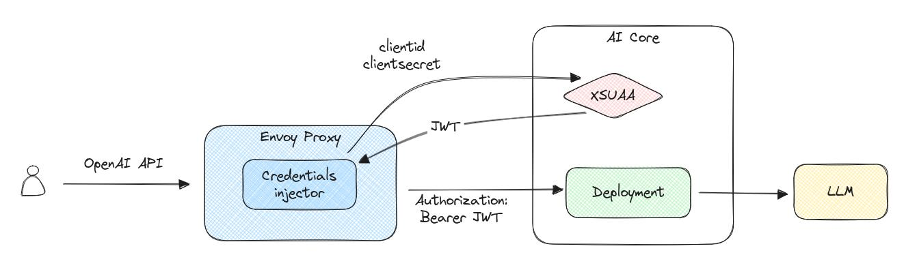
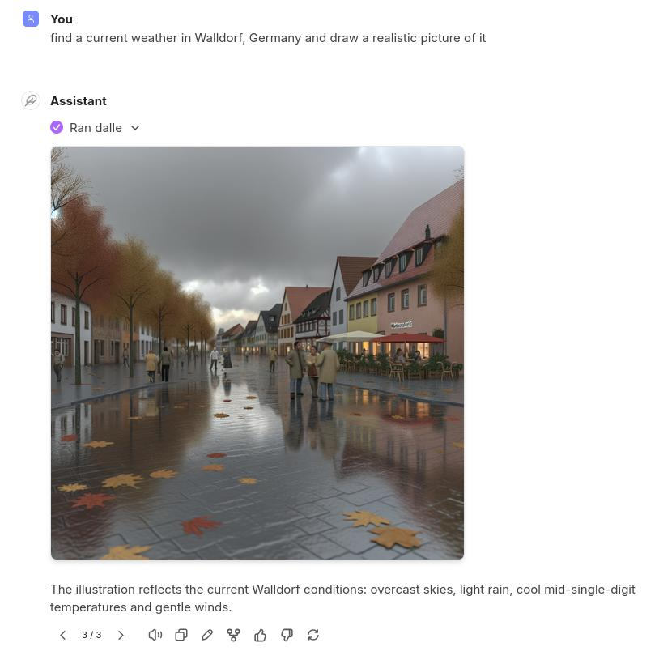

# Using the OpenAI SDK to Access GPT Models Hosted in SAP AI Core

This is the `Part 1` of a series describing how to use Envoy Proxy to create an API layer to access models from AI Core using native SDKs of LLM providers, such as OpenAI, Anthropic, and Google.

First, we use the [OpenAI Python API library](https://pypi.org/project/openai/) to work directly with an LLM in AI Core and then apply the same approach to connect the [LibreChat](https://www.librechat.ai/) UI, creating a powerful personal AI assistant.

## Introduction

When SAP AI Core introduced the Generative AI Hub, accessing hosted LLMs with the native OpenAI libraries became challenging. The AI Core's REST API used slightly different URL paths and required OAuth2 authentication instead of a plain service key used by OpenAI.  The [SAP Cloud SDK for AI](https://pypi.org/project/sap-ai-sdk-gen/) was released to overcome those differences, but it didn't solve all problems.

Numerous products work with GPT models using OpenAI's native API and they don't usually provide integrations with AI Core.  What if we want to use those products now and power them through AI Core?

Let's explore how we can do such integration on our own!


## Envoy Proxy to the Rescue

As mentioned above, there are two major obstacles to using the OpenAI's native SDKs:

1. They don't support OAuth2 authentication required by AI Core.
2. They expect a specific URL path when creating HTTP requests to a model server which may differ in AI Core.

With [Envoy](https://www.envoyproxy.io/), we can run a local reverse proxy that intercepts HTTP requests from a native SDK and converts them on the fly into calls compatible with AI Core.



The power of Envoy comes from its collection of filters that can be applied to HTTP requests before sending them to an upstream service.  We will use the [Credential injector](https://www.envoyproxy.io/docs/envoy/latest/configuration/http/http_filters/credential_injector_filter) filter to solve the first problem and Envoy's rich HTTP routes manipulation capabilities to overcome the second.

### Install Envoy

There are a number of ways to install Envoy, the easiest one is to follow official documentation [Installing Envoy](https://www.envoyproxy.io/docs/envoy/latest/start/install).  After that, it should be available in the terminal:

```
$ envoy --version

envoy  version: 84305a6cb64bd55aaf606bdd53de7cd6080427a1/1.35.0/Clean/RELEASE/BoringSSL
```

### Access AI Core

Now, let's look at an Envoy config file (The full version is available here: [envoy-aicore.yaml](envoy-aicore.yaml))

The head of the config file is pretty standard and specifies a listener on the port 8100 and enables access logs.

Now the important part:

```yaml
routes:
- match:
    prefix: "/"
  route:
    auto_host_rewrite: true
    cluster: aicore
    timeout: 300s
  request_headers_to_add:
  - header:
      key: "AI-Resource-Group"
      value: "default"
    append_action: ADD_IF_ABSENT
```

The section above defines routes: all requests will be redirected to the cluster `aicore` (defined below) with an extra HTTP header "AI-Resource-Group" attached to it.  Since I'm using the `default` resource group, the header's value is set to this value.

Then follows the "Credential injector" filter configuration:

```yaml
http_filters:
- name: envoy.filters.http.credential_injector
  typed_config:
    "@type": type.googleapis.com/envoy.extensions.filters.http.credential_injector.v3.CredentialInjector
    allow_request_without_credential: true
    overwrite: true
    credential:
      name: envoy.http.injected_credentials.oauth2
      typed_config:
        "@type": type.googleapis.com/envoy.extensions.http.injected_credentials.oauth2.v3.OAuth2
        token_endpoint:
          cluster: xsuaa
          timeout: 600s
          uri: "<url>/oauth/token"
        client_credentials:
          client_id: "<clientid>"
          client_secret:
            name: client-secret
```

It says it will inject OAuth2 JWT token received from the `xsuaa` cluster (defined below) using access credentials defined by `uri`, `client_id` and `client_secret` with values should be set according to values in a service key for AI Core (See [Create a Service Key](https://help.sap.com/docs/sap-ai-core/sap-ai-core-service-guide/create-service-key)).  The names in angle brackets should be replaced with real values from your json, i.e. `<url>` and `<clientid>` should be the replaced with the real credentials.  The value of the `client_secret` is set through the following section where the actual value should replace `<clientsecret>`:

```yaml
secrets:
- name: client-secret
  generic_secret:
    secret:
      inline_string: "<clientsecret>"
```

And finally there are `xsuaa` and `aicore` clusters configurations.  Let's look into the `aicore` cluster section, the `xsuaa` one is configured similarly.

```yaml
- name: aicore
  connect_timeout: 5s
  type: LOGICAL_DNS
  lb_policy: ROUND_ROBIN
  load_assignment:
    cluster_name: aicore
    endpoints:
    - lb_endpoints:
      - endpoint:
          address:
            socket_address:
              address: <DOMAIN NAME AI_API_URL>
              port_value: 443
  transport_socket:
    name: envoy.transport_sockets.tls
    typed_config:
      "@type": type.googleapis.com/envoy.extensions.transport_sockets.tls.v3.UpstreamTlsContext
      sni: <DOMAIN NAME AI_API_URL>
```

The `address` and `sni` values should contain the domain name and not the URL, e.g. it should be `api.ai.XXXXXXXXX.ml.hana.ondemand.com` if the service key contains:

```yaml
"serviceurls": {
  "AI_API_URL": "https://api.ai.XXXXXXXXX.ml.hana.ondemand.com"
},
```

If everything configured correctly, we should be able to start the Envoy and see requests passing successfully to the AI Core API.

```
$ envoy -c envoy-aicore.yaml
...
[2025-11-22 16:28:15.055][1125647][info][upstream] [source/common/upstream/cluster_manager_impl.cc:248] cm init: all clusters initialized
[2025-11-22 16:28:15.055][1125647][info][main] [source/server/server.cc:1023] all clusters initialized. initializing init manager
[2025-11-22 16:28:15.055][1125647][info][config] [source/common/listener_manager/listener_manager_impl.cc:1003] all dependencies initialized. starting workers
```

Now, let's submit a test request to see everything is working.  In another terminal run the command:

```
$ curl http://localhost:8100/v2/lm/meta
```

It should return a JSON with information about the AI API:

```
{"runtimeIdentifier": "aicore", "runtimeApiVersion": "2.40.0", "aiApi": {"version": "2.31.0", ...
```

And in the Envoy's logs we should see the request:

```
[2025-11-22T15:31:13.599Z] "GET /v2/lm/meta HTTP/1.1" 200 - 0 952 150 149 "-" "curl/8.17.0" ...
```


## Use OpenAI Python SDK

Now we can finally enjoy the fruits of all the hard work we did in the previous section.

AI Core provides an access to OpenAI models through Microsoft Azure.  Because of this, we should call models with [Azure OpenAI](https://github.com/openai/openai-python?tab=readme-ov-file#microsoft-azure-openai).  Set the `azure_endpoint` to the Envoy's address, `api_key` can be any string since it's ignored and in the `model` we should provide an AI Core model `Deployment-ID` instead of a model name:

```python
from openai import AzureOpenAI

client = AzureOpenAI(
    azure_endpoint="http://localhost:8100",
    api_version="2024-12-01-preview",
    api_key="",
)

completion = client.chat.completions.create(
    model="d444da8fdb7a86a1",
    messages=[
        {
            "role": "user",
            "content": "Write a one-sentence bedtime story about a unicorn.",
        },
    ],
)

print(completion.choices[0].message.content)
```

Now run it:

```
$ uv run --with openai test-openai.py
...
openai.NotFoundError: Error code: 404
```

Hmm, that's not what we hoped for.  Let's check the Envoy's logs:

```
[2025-11-22T16:04:29.342Z] "POST /openai/deployments/d444da8fdb7a86a1/chat/completions?api-version=2024-12-01-preview HTTP/1.1" 404 - 124 0 112 112 "-" "AzureOpenAI/Python 2.8.1" ...
```

We can see that we’re encountering problem #2.  The library inserts the `/openai` prefix into the URL while AI Core's deployment URL starts with the `/v2/inference`.  Fortunately, it's easy to fix.  We just insert a new route matching all requests starting with the "/openai" and tell Envoy to replace everything in the path before "/deployments" with "/v2/inference" and send these modified requests to AI Core:

```yaml
- match:
    prefix: "/openai"
  route:
    auto_host_rewrite: true
    cluster: aicore
    timeout: 300s
    regex_rewrite:
      pattern:
        google_re2: {}
        regex: "^.*/(deployments/.*)$"
      substitution: "/v2/inference/\\1"
  request_headers_to_add:
  - header:
      key: "AI-Resource-Group"
      value: "default"
    append_action: ADD_IF_ABSENT
```

And finally it works!

```
$ uv run --with openai test-openai.py
Under the silver glow of a sleepy moon, a gentle unicorn tiptoed through whispered starlight, leaving trails of twinkling dreams for every child to follow into slumber.
```


## Bonus: Connect LibreChat

[LibreChat](https://www.librechat.ai/) is an open-source app for AI conversations, letting you combine the power of reasoning models with tools for information extraction, image generation, and more.

Follow the official [Docker installation instructions](https://www.librechat.ai/docs/local/docker), then modify two files for configuration.

LLM configuration goes to the `librechat.yaml`, important parts here are `baseURL` to let docker to connect to our local Envoy, model's name and deployment:

```yaml
azureOpenAI:
  titleModel: "current_model"
  groups:
    - group: "aicore"
      apiKey: "not-used"
      baseURL: "http://host.docker.internal:8100/openai"
      version: "2024-12-01-preview"
      instanceName: "my-instance"
      models:
        gpt-5:
          deploymentName: "d444da8fdb7a86a1"
```

Image generating models are configured differently, need to edit the `.env` file to change few environment variables to point to the DALL-E deployment in AI Core:

```yaml
DALLE3_BASEURL=http://host.docker.internal:8100/openai/deployments/de8d5eedfd8f24cb
DALLE3_AZURE_API_VERSION=2025-04-01-preview
```

After restarting the container, navigate to http://localhost:3080 in your browser.  Can see the "gpt-5" model under "Azure OpenAI".

For advanced use, configure an agent under "My Agents" menu, add tools, e.g. OpenWeather, DALLE-E-3, etc. And enjoy!


